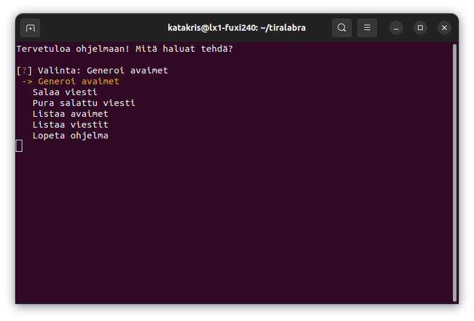

# Asennus

## Alkuvalmistelut
Varmista että Python ja Poetry ovat asennettuna suorittamalla terminalissa komento:
```
python3 --version; poetry --version
```
Komennon tulisi tulostaa Pythonin ja Poetryn versiot.

## Projektin lataaminen ja määrittely

Lataa projektin zip-kansio tai kloonaa projekti tietokoneellesi. Voit halutessasi myös ladata uusimman releasen. Jos latasit zip-kansion, se pitää purkaa komennolla unzip.

Siirry projektin kansion sisälle ja suorita komento:
```
poetry install
```
Tämä asentaa projektin riippuvuudet.

# Käyttäminen

Käynnistä ohjelma komennolla:
```
poetry run invoke start
```

Ohjelmalla on komentorivikäyttöliittymä, valintaa voi vaihtaa nuolinäppäimille ja Enter valitsee. Nykyinen valinta on merkitty keltaisella tekstillä.



Jotta voit tehdä mitään, sinun tulee ensin luoda RSA-avainpari, tee se valitsemalla "Generoi avaimet". Seuraavaksi ohjelma tarjoaa vaihtoehtoja avainkoosta. Suurempi avainkoko on turvallisempi, mutta sen luominen on hitaampaa. Avainparille annetaan myös nimi, jotta sen voi myöhemmin tunnistaa.


Kun avainpari on luotu, voit salata viestin valitsemalla päävalikosta "Salaa viesti". Seuraavaksi pitää valita käytettävä julkinen avain, antaa viestin tiedoston nimen ja itse viestin sisältö.


Kun viesti on salattu, salauksen voi purkaa valitsemalla päävalikosta "Pura salattu viesti". Seuraavaksi pitää valita käytettävä yksityinen avain, sekä viesti, jonka haluat purkaa. Jos viestin purkaminen onnistui, viesti ilmestyy näytölle. Jos taas viestin purkaminen epäonnistui, siitä ilmoitetaan. Viestin purkaminen voi epäonnistua jos valitsit väärän avaimen, millä purkaa.

Päävalikossa on vaihtoehdot "Listaa avaimet" ja "Listaa viestit". Nämä nimensä mukaan vain listaavat näytölle kaikki avaimet ja viestit, jotka ohjelma tunnisti. Avaimet ja viestit tuodaan tiedostoista vain ohjelman käynnistyksen yhteydessä, joten jos manuaalisesti lisäät avaimen tai viestin projektin juurihakemistoon, ohjelma tulee käynnistää uudelleen.

Ohjelman käytön voi lopettaa valitsemalla päävalikosta "Lopeta ohjelma"
