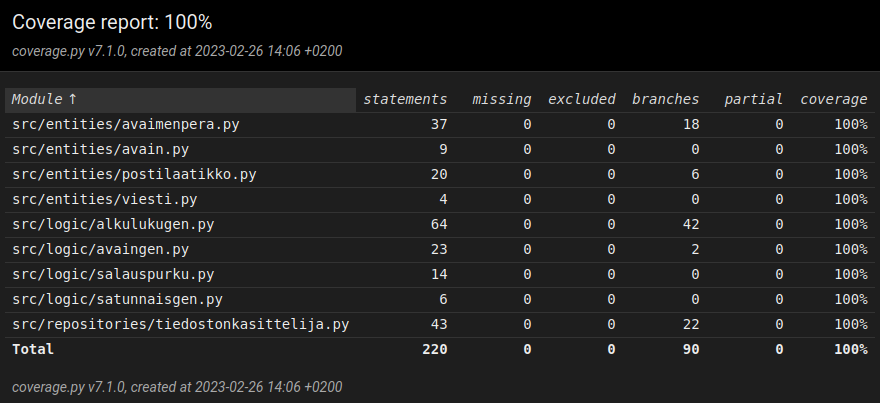

# Testausdokumentti

## Yksikkötestaus

### Yksikkötestauksen kattavuusraportti



Ajankohtaisimman kattavuusraportin näet [codecovista](https://app.codecov.io/gh/katajak/tiralabra).

### Testaus

Ohjelma on testattu automaattisilla yksikkötesteillä ja käsin. Yksikkötestejä on tehty testaamaan yksittäisten metodien lisäksi myös ns. end-to-end testejä viestin salaamisessa ja purkamisessa. Yksikkötesteissä on pyritty käyttämään realistisia syötteitä mutta vanhojen testien päivitys on vielä kesken.

### Testien suoritus

Yksikkötestit voidaan suorittaa komennolla:

```bash
poetry run invoke test
```

## Suorituskykytestaus

### Testaus

Suorituskykytestaus toteutettiin performance.py tiedostolla, jossa lasketaan avainten generointiin kuluvan ajan keskiarvo jokaisella ohjelman tarjoamalla avainkoolla. Kaikissa testeissä keskiarvo laskettiin ottamalla keskiarvo 20:stä suorituskerrasta.

### Tulokset

- 1024 bit: 0.09182636737823487 sekuntia
- 2048 bit: 0.8550775647163391 sekuntia
- 4096 bit: 8.6403369307518 sekuntia

### Testien suoritus

Suorituskykytestit voidaan suorittaa komennolla:

```bash
poetry run invoke performance-test
```
